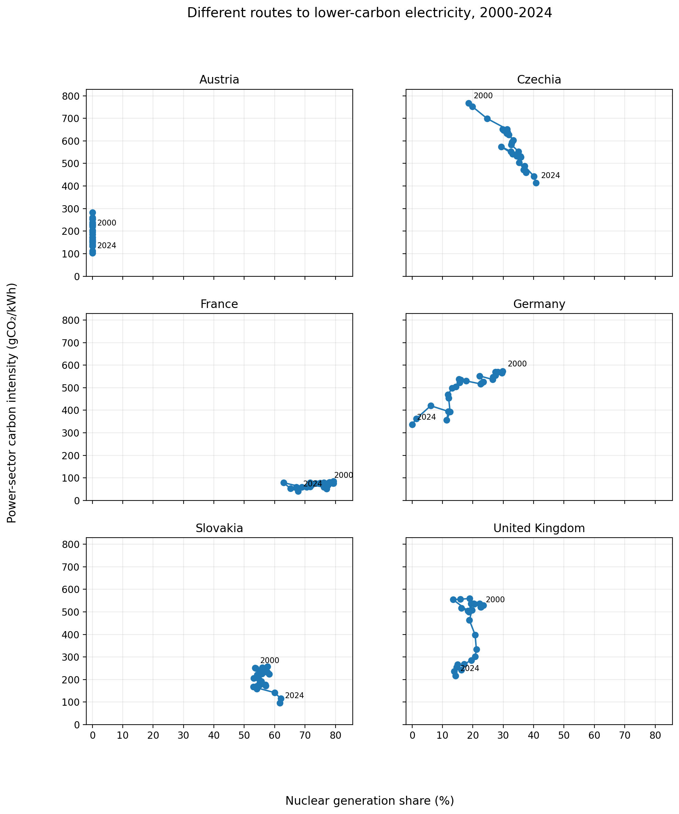
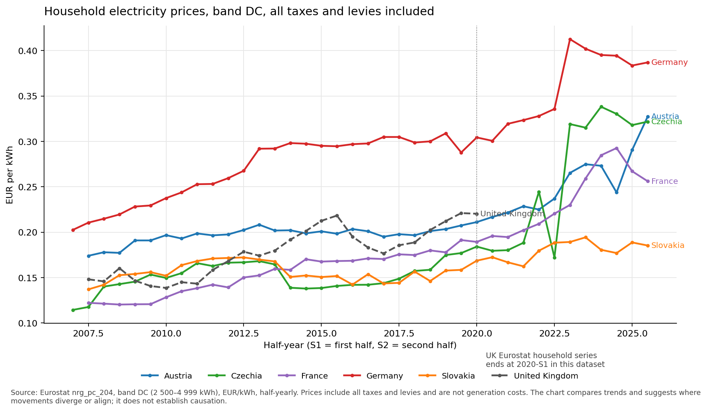

# European Power Mix Analysis: Nuclear, Prices and Carbon

A Python and Power BI portfolio project investigating whether nuclear-heavy European electricity systems are associated with cheaper, cleaner or less volatile electricity, and what Austria's non-nuclear model reveals.

The project is not here to argue for or against nuclear power. It investigates what the data can show, and what the data cannot prove. The analytical style is influenced by Hans Rosling and Gapminder: use data to challenge assumptions, make complex patterns easier to understand, and avoid simplistic slogans.

---

## Research question

**Main question.** Are nuclear-heavy European electricity systems associated with cheaper, cleaner or less volatile electricity, and what does Austria's non-nuclear model reveal?

**Sub-questions.**

1. How does the generation mix differ across the six selected countries, and how has it changed since 2000?
2. Is a higher nuclear share associated with a lower power-sector carbon intensity, after considering hydro and renewables?
3. How do household and non-household electricity prices compare, and how do they relate, if at all, to the generation mix?
4. What does Austria's high-hydro, no-nuclear model suggest about alternative low-carbon paths, and what makes it hard to generalise?
5. Where do the data run out: what cannot be inferred from yearly national averages alone?

---

## Countries

Austria, United Kingdom, France, Germany, Czechia, Slovakia.

The selection contrasts a non-nuclear hydro-heavy system (Austria), a nuclear-dominated system (France), a system that completed its nuclear phase-out in 2023 (Germany), a system with significant wind and gas (United Kingdom), and two smaller Central European systems with material nuclear and coal exposure (Czechia, Slovakia).

---

## Data sources

| Source                                   | Use                                                              | Status                |
| ---------------------------------------- | ---------------------------------------------------------------- | --------------------- |
| Ember Electricity Data Explorer (yearly) | Generation mix, demand, power-sector emissions, carbon intensity | Loaded                |
| Eurostat `nrg_pc_204`                    | Household electricity prices, biannual                           | Loaded                |
| Eurostat `nrg_pc_205`                    | Non-household electricity prices, biannual                       | Loaded for inspection |
| IAEA PRIS                                | Nuclear reactor status and capacity                              | Planned               |
| ENTSO-E Transparency Platform            | Hourly generation and price data for volatility analysis         | Later phase           |
| Electricity Maps                         | Consumption-based carbon intensity for cross-validation          | Later phase           |

Raw data is not committed to this repository. See `docs/source_notes.md` for licences, vintage and access notes.

---

## Current status

* First dataset review notebook created (`notebooks/01_dataset_review.ipynb`).
* Ember generation data loaded and filtered to the six selected countries.
* Latest-year generation mix summaries created.
* Nuclear, hydro, gas, coal, wind and solar shares compared.
* Low-carbon vs fossil generation comparison created.
* Carbon intensity comparison added.
* Eurostat household electricity price data loaded.
* Household prices filtered to a comparable medium consumption band (DC, 2,500-4,999 kWh, all taxes and levies included, EUR).
* Household price analysis notebook created (`notebooks/02_price_analysis.ipynb`).
* Household price trend chart created for Eurostat `nrg_pc_204`, band DC, all taxes and levies included, EUR/kWh.
* Household price processed outputs exported for later Power BI use.
* Eurostat non-household electricity price data (`nrg_pc_205`) inspected for coverage and comparability.
* Current price work confirms that the UK household series ends at 2020-S1 in the Eurostat file used here, so the UK is not included in 2025-S2 household price comparisons.
* Findings to date are descriptive only and do not claim causation.

See `docs/progress_log.md` for the dated working log.

---

## First visual output: nuclear share and carbon intensity



*Connected scatter, 2000-2024. Each line shows one country's path through nuclear share (x-axis) and power-sector carbon intensity (y-axis).*

This is where things start to get interesting. Czechia and Slovakia appear to reduce carbon intensity while nuclear share stays high or rises. France also sits in the high-nuclear, low-carbon part of the chart. The pattern suggests it is not realistic to assume "more nuclear = lower carbon".

Germany and the United Kingdom reduce carbon intensity while nuclear share falls, and Austria reduces carbon intensity with no nuclear generation at all. The useful takeaway is more nuanced: different countries seem to reach lower-carbon electricity through different routes. Nuclear is one route in this group, but hydro, renewables, coal reduction and wider system choices clearly matter too.

This is a descriptive interpretation. See `docs/caveats.md` for the full limitations.

---

## Second visual output: household electricity prices



*Household electricity prices, 2007-S2 to 2025-S2. Eurostat `nrg_pc_204`, band DC, all taxes and levies included, EUR/kWh. UK coverage stops at 2020-S1 in this dataset.*

This price view starts from a practical concern in Austria: what households actually pay for electricity. Household prices rise across several selected countries after 2021-2022, but the size and timing of the rise differ by country.

Germany is high across much of the series. Austria rises strongly after 2022. Czechia also shows a sharp post-2022 increase, while France rises more gradually and Slovakia remains lower than the other full-coverage countries in the 2025-S2 comparison.

The United Kingdom is shown only up to 2020-S1 because the UK household series stops there in this Eurostat file. These are consumer prices, not generation costs, so they need to be interpreted alongside taxes, levies, network costs, market design, policy choices and generation mix.

## Planned spatial analysis extension: UK regional carbon intensity

A new priority for this project is to add a UK regional carbon-intensity map. The first version will test whether the data is best shown by county, ITL/NUTS region, or electricity grid region.

This extension moves the project beyond country-level comparison and adds a spatial analysis layer. It is intended to demonstrate mapping, regional comparison, boundary matching, data-quality judgement and Power BI-ready reporting.

The map will be descriptive only. Regional carbon-intensity differences may reflect generation location, demand patterns, grid-region definitions, imports, time of day and dataset coverage. The output will not claim that one region "causes" another to be cleaner or dirtier.

---

## Repository structure

```
.
├── data/
│   ├── raw/          # Not committed. See docs/source_notes.md.
│   └── processed/    # Small derived tables.
├── notebooks/
│   ├── 01_dataset_review.ipynb
│   └── 02_price_analysis.ipynb
├── outputs/
│   └── charts/
│       ├── connected_scatter_nuclear_share_carbon_intensity_2000_2024.png
│       └── household_price_trend_band_dc_all_taxes_2007_2025.png
├── docs/
│   ├── progress_log.md
│   ├── source_notes.md
│   ├── methodology.md
│   ├── glossary.md
│   └── caveats.md
├── README.md
└── .gitignore
```

---

## What this project is, and what it is not

**It is.**

* An exploratory, descriptive comparison of six European electricity systems.
* An attempt to be careful with vocabulary, units and time-period alignment.
* A portfolio piece showing data ingestion, cleaning, joining, visualisation and reporting.

**It is not.**

* An advocacy piece for or against nuclear power.
* A cost-of-electricity model. Eurostat consumer prices include taxes, levies, network costs and policy choices that are not generation costs.
* A causal study. Nothing here separates the effect of generation mix from market design, geography, interconnection or fiscal policy.
* A grid-stability study. Yearly national averages cannot speak to volatility. ENTSO-E hourly data is in a later phase.

---

## Methodology principles

Full notes in `docs/methodology.md`.

* Country names follow Ember's labelling: "United Kingdom", "Czechia".
* Generation mix is built from Ember individual fuels (Subcategory = "Fuel"), not the rolled-up "Aggregate fuel" rows, to avoid double counting.
* Carbon intensity uses Ember's gCO₂/kWh metric, which is generation-based, not consumption-based.
* Trend charts use 2024 as the latest full year. 2025 is excluded unless explicitly marked preliminary.
* Household prices use band DC (2,500-4,999 kWh), all taxes and levies included, EUR per kWh.
* UK household price coverage in the Eurostat file used here ends at 2020-S1, so UK data is not mixed into 2025-S2 household price comparisons.
* Household and non-household prices are kept separate because they use different consumption bands and customer definitions.
* Where Ember generation and Eurostat price periods do not align, the shorter common window is used and the misalignment is stated near the chart.

---

## Vocabulary discipline

Wording is part of the analysis. Specific words have been chosen to keep claims proportional to the evidence.

**Used:** investigates, compares, is associated with, suggests, consistent with, needs further analysis.

**Avoided:** proves, settles the debate, nuclear is cheaper, Austria proves, France proves, definitive.

---

## Caveats (summary)

Full list in `docs/caveats.md`.

* Generation mix is not the same as consumption mix; imports and exports are not netted out.
* Carbon intensity is power-sector only, not economy-wide.
* Household price drivers are not limited to generation.
* Household prices are consumer prices and include taxes, levies, network charges and retail margins.
* The UK household price series in the Eurostat file used here ends at 2020-S1.
* The six countries differ in geography, market design, interconnection and history. Comparisons are illustrative, not controlled.
* Austria's hydro share is partly Alpine geography; not directly replicable.
* Germany's series shows a structural break around 2022-2023 (nuclear phase-out, coal reduction).
* France's nuclear-dominated mix reflects decades of central-state programme; the model is not portable.

---

## Reproducibility

```bash
python -m venv .venv
.venv\Scripts\activate          # Windows
pip install jupyter pandas matplotlib
jupyter lab
```

Raw data must be downloaded manually from the sources listed in `docs/source_notes.md` and placed under `data/raw/<source>/`.

---

## Roadmap

1. Add UK regional carbon-intensity mapping as a top-priority spatial analysis extension.
2. Extend non-household electricity price analysis using Eurostat `nrg_pc_205`.
3. Add IAEA PRIS nuclear reactor status and capacity.
4. Check time-period alignment between Ember and Eurostat in detail.
5. Decide how to handle UK missing or older price data.
6. Prepare clean Power BI-ready processed tables.
7. Build first Power BI dashboard prototype.
8. Add ENTSO-E hourly volatility analysis (later phase).
9. Cross-validate Ember carbon intensity against Electricity Maps (later phase).

---

## Attribution

Data © respective providers (Ember, Eurostat, IAEA, ENTSO-E, Electricity Maps). This repository does not redistribute their data.

---

## Licence

Code in this repository is released under the MIT Licence. Data is not relicensed; see `docs/source_notes.md` for each source's terms.

---
